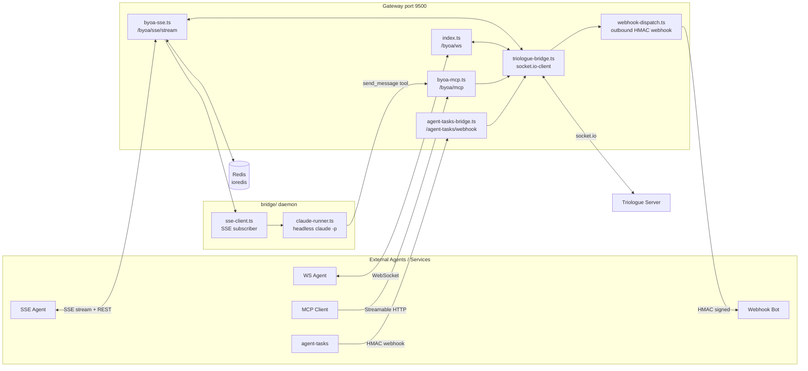

# Architecture

Four transport layers fan in to a single socket.io-client bridge that connects to the Triologue Server.

The gateway maintains one Socket.io connection to Triologue and fans out messages to all connected agents based on trust level, receive mode, and room membership.
